# Agent Proxies — exposing real upstreams to a sandboxed agent VM

The testnet has **two distinct ways** to make a domain reachable from inside an
agent VM. They look the same to the agent but live at very different layers.
Knowing which one you want is half the battle.

## TL;DR

| Concern | Server-side spoofing (`nodes.yaml`) | Client-side passthrough (`testnet-client agent proxy`) |
|---|---|---|
| Where it lives | Operator's `configs/nodes.yaml` + the testnet's DNS, VIP allocator, router DNAT, and CA. | Each client host's `testnet-client` daemon. |
| Who sees the request? | A testnet **node** the operator deployed. | The **real upstream domain** on the public internet. |
| TLS termination | The node, using a cert signed by the testnet CA. | End-to-end to the real upstream — the proxy is a dumb TCP forwarder. |
| Resolves to | Operator-allocated VIP in `83.150.0.0` .. `83.150.254.255`. | Per-VM passthrough IP — public-looking (`83.150.255.x`) or private (`172.16.<vmIndex>.x`). |
| Lifecycle | Edit `nodes.yaml`, `bash deploy/aws-deploy.sh reload`. Affects all clients. | `testnet-client agent proxy add/remove`. Per-agent-VM, per client. |
| Use it for | Faking sites the agent should think are real (Google, Reddit, GitHub) — content is operator-controlled. | Letting the agent reach a real third-party API (LLM provider, package registries) the operator can't host inside the testnet. |

If you're operating the testnet, you almost certainly want server-side
spoofing. If you're shipping an agent setup that needs to call out to e.g.
`api.openrouter.ai` from inside its VM, you want client-side passthrough.

## IP layout

```
83.150.0.0/16    VIP space (config.VIPSubnetDefault)
├── 83.150.0.1               DNS VIP (config.DNSVIPDefault)
├── 83.150.0.2 – 254.255     Server-side VIP allocator pool (testnet services)
└── 83.150.255.0/24          RESERVED for client-side public passthrough proxies

172.16.<vmIndex>.0/24        Per-VM TAP subnet
├── 172.16.<vmIndex>.1               Host gateway (TAP)
├── 172.16.<vmIndex>.2               Guest IP
└── 172.16.<vmIndex>.10 – .254       Client-side private passthrough proxies
```

These constants live in [`pkg/config/config.go`](../pkg/config/config.go)
(`VIPAllocatorMaxOctet`, `ClientPassthroughSubnet`, `ClientPrivateProxyOffset`).
The server-side `VIPAllocator` (see
[`server/controlplane/vipalloc.go`](../server/controlplane/vipalloc.go)) is
clamped to never return an address in the reserved tail, so the two halves
can't collide.

## Server-side spoofing — `nodes.yaml` flow

This is the original testnet architecture. See
[`docs/node-development.md`](node-development.md) for the full guide.

In one sentence: declare a domain in `nodes.yaml`, deploy a testnet node that
serves it on its real address, the server allocates a VIP and points DNS at
it, and the server's iptables DNAT routes the VIP to the node over WireGuard.
The agent's HTTPS client sees a cert signed by the testnet CA.

```yaml
# configs/nodes.yaml
nodes:
  - name: search
    address: "52.51.95.13:443"
    secret: "..."
    domains:
      - google.com
      - www.google.com
```

After `bash deploy/aws-deploy.sh reload`, every client's agent VMs see
`google.com` resolve to `83.150.x.y` and any HTTPS to it lands on the
operator's `search` node.

## Client-side passthrough — `testnet-client agent proxy`

This is per-client, per-VM, and forwards bytes verbatim to a real upstream.
TLS is end-to-end, so the cert that validates is whatever the real upstream
serves.

### How it works

```mermaid
flowchart LR
    Agent["agent in VM"] -->|"HTTPS to openrouter.ai"| EtcHosts["VM /etc/hosts"]
    EtcHosts -->|"83.150.255.10"| DefaultRoute["VM default route 172.16.10.1"]
    DefaultRoute -->|"dst 83.150.255.10"| Tap["host tap-10 alias 83.150.255.10"]
    Tap -->|"local IP -> INPUT"| Iptables["iptables INPUT ACCEPT 443"]
    Iptables --> Forwarder["Go TCP forwarder (daemon)"]
    Forwarder -->|"net.Dial(openrouter.ai:443)"| Upstream["real openrouter.ai"]
```



Key trick: the forwarder's IP is **aliased onto the VM's TAP device on the
host**. The kernel routes packets to the local stack (INPUT chain) before any
FORWARD rule runs, so the forwarder receives the connection regardless of the
TAP's restrictive FORWARD policy.

The TCP forwarder is a dumb byte pump — it never speaks TLS. The agent's TLS
client sends SNI for the spoofed hostname; we connect upstream to the same
hostname; the cert presented by the real upstream matches.

### CLI

```bash
# Default: public visibility (83.150.255.x), 443/tcp, upstream = <domain>:443.
sudo testnet-client agent proxy add agent-10 openrouter.ai

# Private (172.16.<vm>.x). Useful for plumbing whose consumers don't care
# about the source IP — apk, npm, git, etc.
sudo testnet-client agent proxy add agent-10 dl-cdn.alpinelinux.org --visibility private

# Custom port and upstream:
sudo testnet-client agent proxy add agent-10 my-thing.example \
    --port 80 --port 443 --upstream my-thing.example:443

# Inspect / remove:
sudo testnet-client agent proxy list agent-10
sudo testnet-client agent proxy remove agent-10 openrouter.ai
```

The daemon owns the lifecycle: TAP alias, iptables INPUT ACCEPT, the TCP
forwarder goroutines, and the VM `/etc/hosts` entry (written via SSH using the
agent's per-VM ephemeral key). Stopping the agent (`testnet-client agent
stop <id>`) tears all of them down automatically.

### When to use which visibility

- **Public** (default). Anything an SSRF-aware agent might inspect. OpenClaw's
  `[security] blocked URL fetch` guard rejects URLs that resolve to RFC1918 /
  link-local / "special-use" IPs — putting `openrouter.ai` on `83.150.255.x`
  avoids that block while still routing through the host's local TCP forwarder.
- **Private**. Install-time plumbing where the agent (or its tools) doesn't
  care about the source IP. Cheap, never collides across VMs because each VM
  has its own /24.

## State files

| Path | Purpose |
|---|---|
| `~/.testnet/data/agents/<agent-id>/proxies.json` | Snapshot of currently-running proxies for an agent. Written by the daemon for inspection; not used to restore state on daemon restart. |
| `~/.testnet/data/agents/<agent-id>/ssh_key` | Per-VM ephemeral SSH private key the daemon uses to write `/etc/hosts` inside the VM. |

## Working examples in this repo

- [`scripts/install-openclaw.sh`](../scripts/install-openclaw.sh) is the
  canonical client-side passthrough consumer. It uses **private** proxies for
  the install-time plumbing (`dl-cdn.alpinelinux.org`, `registry.npmjs.org`,
  `github.com`, `codeload.github.com`) and a **public** proxy for the LLM API
  domain (`api.anthropic.com` / `openrouter.ai` / etc.).
- [`scripts/vm-integration-test.sh`](../scripts/vm-integration-test.sh) covers
  both visibilities end-to-end against a real public domain.

## Implementation pointers

| Layer | File |
|---|---|
| IP layout constants | [`pkg/config/config.go`](../pkg/config/config.go) |
| Server-side allocator clamp | [`server/controlplane/vipalloc.go`](../server/controlplane/vipalloc.go) |
| Per-host proxy IP allocator | [`client/sandbox/proxy_alloc.go`](../client/sandbox/proxy_alloc.go) |
| TCP forwarder + TAP alias + iptables + /etc/hosts | [`client/sandbox/proxy.go`](../client/sandbox/proxy.go) |
| Daemon API | [`client/daemon/proxy.go`](../client/daemon/proxy.go) |
| CLI | [`client/cli/agent.go`](../client/cli/agent.go) (`agent proxy` subtree) |
| API types | [`pkg/api/types.go`](../pkg/api/types.go) (`ProxyConfig`, `ProxyInfo`, `ProxyRef`) |
